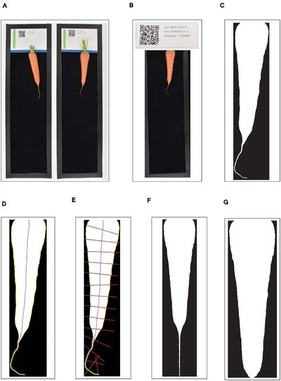

# CarrotSweeper
Digital image-based phenotyping platform to analyze carrot root shape
attributes. <br />

**Refer to the publication resulting from this study:** <br />
[A Digital Image-Based Phenotyping Platform for Analyzing Root Shape
Attributes in Carrot](https://doi.org/10.3389/fpls.2021.690031)

 <br /><br />

**[Figure 1 from referenced paper]** *Workflow outlining the pre-processing*
*of carrot root images.* **(A)** Each black-bordered box within the overall
image are identified; **(B)** QR codes within the upper portion of each box are
scanned and the encoded text is displayed as a form of quality control;
**(C)** carrot pixels are distinguished from background pixels to generate
binary masks; **(D)** the midline of the carrot root is estimated by tracing a
path from the carrot tip to the center of the shoulder, following the maximum
of the smoothed Euclidean distance transform; **(E)** width measurements are made
by sampling the binary mask normal to vectors tangent to the midline; **(F,G)**
A random forest classifier is used to detect the point at which to “de-tip” any
residual, unexpanded tap root.*

***The image pre-processing pipeline to obtain binary masks of carrot images can
be found in the [carrot-phenotyping](https://github.com/shbrainard/carrot-phenotyping)
repository***

---
### Getting Started
#### Dependencies
- **MATLAB Version**
    - This tool was developed on **Matlab R2020a**. Versions slightly earlier
      or later should work fine but are not guaranteed.
- **MATLAB Toolboxes**
    - [Image Processing Toolbox](https://www.mathworks.com/products/image-processing.html)
    - [Statistics and Learning Toolbox](https://www.mathworks.com/products/statistics.html)

This repository uses many functions from my other GitHub repo,
[HypoQuantyl](https://github.com/jbustamante35/hypoquantyl) (HQ). The full list
of functions taken from HQ are found in the [dependencies](./dependencies) text
file in the main directory of this repo.

#### Installation
Clone this repository to your file system, then simply add carrotsweeper to
your MATLAB search path with sub-folders.

```bash
git clone https://github.com/jbustamante35/carrotsweeper
```

---

### CarrotSweeper Pipeline
There are two main sub-directories to perform the major image analysis
tasks: <br />

The [**carrot-straightener**](./carrot-straightener) directory contains the
functions required to generate a midline from the image masks, and then run a
straightening algorithm on that mask. Straightening begins from the tip of the
carrot, which we identify uring a custom tip-finding algorithm.

The [**pca-tools**](./pca-tools) directory contains the analysis functions to
measure and quantify phenotypes such as curvature, width profiles, PCA, etc.

---

### Author
**Julian Bustamante**, PhD Researcher in Cellular and Molecular Biology
(<jbustamante@wisc.edu>) <br />
	University of Wisconsin - Madison, Department of Botany <br />

**Scott Brainard**, PhD Researcher in Plant Breeding and Genetics <br />
	University of Wisconsin - Madison, Department of Horticulture <br />


